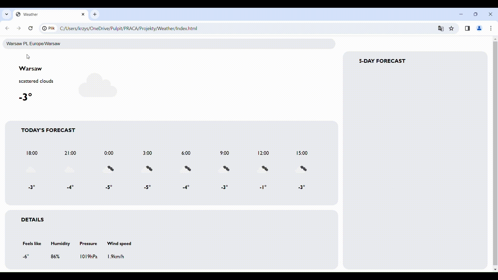
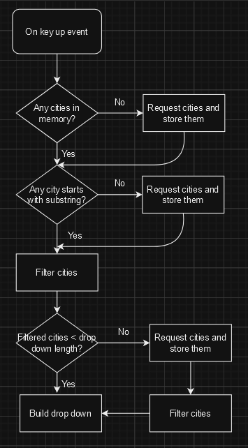
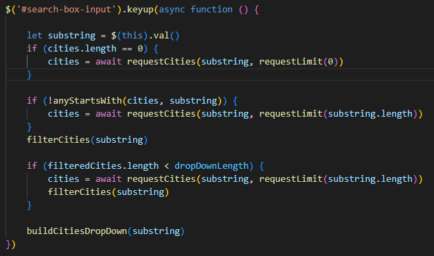
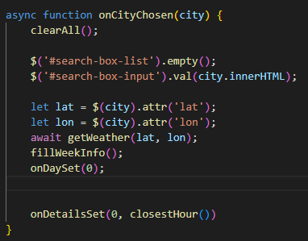

# About The Project
The Weather Forecast Front-End Application utilizes a real-time weather API 
to deliver detailed weather information in three-hour increments. Integrated 
with the [MatchCityNameApi](https://github.com/KrzysztofTybinka/MatchCityNameApi) it features a responsive auto-complete city search bar. 
The application dynamically showcases distinct weather images based on the current 
search, providing users with a visually intuitive representation of weather conditions. 

# Usage

# Code
To display a search bar with suggestions, the application utilizes the MatchCityNameApi, an API connected to a NoSQL database containing over 140,000 cities. It retrieves the API's response with the number of objects specified in the maxRequestNumber constant and stores it in memory to avoid excessive requests. The quantity of fetched objects depends on the letters provided by the user, controlled by a requestLimit exponential function. As the user inputs more letters, the request limit decreases, thereby reducing the number of requested objects and increasing the likelihood of finding the correct city name. Initially, the application checks the objects in memory for a match. If none is found, it sends a new request to the MatchCityNameApi. This approach minimizes the number of requests made by prioritizing matches found in memory before resorting to additional API calls.
 

Flowchart representing filtering process
 

On key up event code, responsible for filtering cities

When user chooses the city, latitude and longitude are being send to weather forecast api, and weather is set to current.  
 

# Contributing
If you wish to contribute to this project, please feel free to create a pull request with your changes.

# License
This project is licensed under the MIT License - see the LICENSE file for details.

